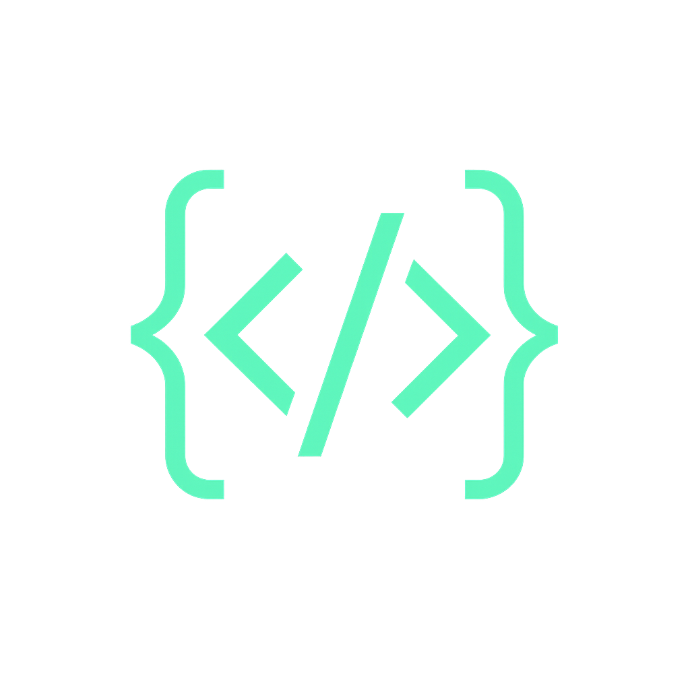

# Nyx Programming Language - VS Code Extension

<p align="center">
  
</p>

<p align="center">
  <a href="https://marketplace.visualstudio.com/items?itemName=SuryaSekharRoy.nyx-language">
    
  </a>
  <a href="https://marketplace.visualstudio.com/items?itemName=SuryaSekHarRoy.nyx-language">
    
  </a>
  <a href="LICENSE.md">
    
  </a>
</p>

---

## 🚀 What is Nyx?

**Nyx** is a modern, expressive, high-level programming language designed for versatility and performance. Written in C with a custom VM, Nyx combines the simplicity of scripting languages with the power of systems programming.

### What Nyx Can Do:

- **Web Development** - HTTP servers, REST APIs, WebSocket support
- **Systems Programming** - Native performance with low-level memory control  
- **Machine Learning** - Tensor operations, neural networks, autograd
- **Data Science** - Collections, algorithms, FFT, linear algebra
- **Scripting** - Quick automation and prototyping
- **Game Development** - 2D graphics, game engines
- **CLI Applications** - Command-line tools and utilities
- **Cryptography** - Hashing, encryption, JWT, digital signatures
- **Networking** - TCP/UDP sockets, HTTP, WebSocket
- **Database Operations** - SQL, NoSQL, Redis integration
- **Parallel Computing** - Async/await, distributed computing

### What Nyx is Good For:

1. **Rapid Development** - Clean, concise syntax lets you build faster
2. **Cross-Platform** - Runs on Windows, Linux, macOS seamlessly
3. **ML/AI Projects** - Built-in tensor operations and neural network modules
4. **Educational Use** - Simple enough for beginners, powerful for experts
5. **Enterprise Applications** - Robust error handling and testing frameworks
6. **Research & Experiments** - Easy prototyping with extensive stdlib

---

## ✨ Key Features

### Core Language Features
- **Modern Syntax** - Clean, expressive, Python-like readability
- **Object-Oriented** - Classes, inheritance, polymorphism
- **Functional Programming** - First-class functions, closures, comprehensions
- **Memory Safety** - Ownership & borrowing system (like Rust)
- **Error Handling** - Try-catch with custom exceptions
- **Modules** - Import/export system with namespaces

### IDE & Developer Experience
- **Syntax Highlighting** - Full support for `.ny` and `.nx` files
- **Code Snippets** - Common patterns and templates
- **File Icons** - Custom icons for Nyx files
- **Integrated Terminal** - Run Nyx directly in VS Code
- **Debug Support** - Breakpoints, step-through debugging
- **Auto-completion** - Intelligent code suggestions

### Standard Library (80+ Modules)
- **Tensor & Math** - matrix, tensor, linear algebra, FFT
- **Neural Networks** - nn, autograd, optimizers
- **Data Structures** - collections, heap, graph, trie
- **Web & Network** - http, websocket, socket, network
- **Cryptography** - crypto, jwt, hashing, encryption
- **Database** - database, redis, sql support
- **ML/AI** - mlops, experiment, metrics, visualize
- **Async** - async/await, parallel computing

### Package Management
- **nypm** - Full-featured package manager
- **Version Management** - Semantic versioning
- **Registry Support** - Public and private registries
- **Dependency Locking** - Reproducible builds

---

## 📋 Version Verification

### Check Your Nyx Version:

```powershell
# From terminal
nyx --version

# Expected output: 0.20.1 (or newer)
```

### Version in Code:

```nyx
// Get runtime version
print(lang_version());

// Require specific version
require_version(">=0.20.0");

// Check version constraints
require_version("^0.20.0");   // Compatible with 0.20.x
require_version("~0.20.0");    // Exactly 0.20.x
require_version(">=0.20.0");   // 0.20.0 or higher
```

### Extension Version:

The VS Code extension version is displayed in:
- Extension panel in VS Code
- The `.vsix` filename (e.g., `nyx-language-0.20.1.vsix`)

---

## 💻 Code Syntax Overview

### Hello World

```nyx
print("Hello, Nyx!");
```

### Variables & Types

```nyx
// Variables (immutable by default)
let name = "Nyx";
let age = 25;
let is_awesome = true;
let numbers = [1, 2, 3, 4, 5];
let person = { name: "John", age: 30 };
```

### Functions

```nyx
fn greet(name, greeting = "Hello") {
    return greeting + ", " + name + "!";
}

fn add(a, b) {
    return a + b;
}

// Lambda/Anonymous functions
let double = fn(x) { return x * 2; };
```

### Classes & Objects

```nyx
class Person {
    fn init(self, name, age) {
        self.name = name;
        self.age = age;
    }
    
    fn introduce(self) {
        return "I'm " + self.name;
    }
}

let john = new Person("John", 30);
print(john.introduce());
```

### Control Flow

```nyx
// If-else
if age >= 18 {
    print("Adult");
} else {
    print("Minor");
}

// For loop
for num in numbers {
    print(num);
}

// While loop
while i < 5 {
    i = i + 1;
}

// Switch
switch value {
    case 1 { print("One"); }
    default { print("Other"); }
}
```

### Error Handling

```nyx
try {
    let result = risky_operation();
} catch error {
    print("Error: " + str(error));
}

throw "Custom error!";
```

### Array Comprehensions

```nyx
let numbers = [1, 2, 3, 4, 5];
let doubled = [x * 2 for x in numbers];
let filtered = [x for x in numbers if x > 2];
```

### Modules

```nyx
// math.ny
module Math {
    fn square(x) { return x * x; }
}

// Using module
import Math;
print(Math.square(5));  // 25
```

---

## 🛠️ How to Use

### Installation Options

#### Option 1: VS Code Marketplace (Recommended)
1. Open VS Code
2. Press `Ctrl+Shift+X`
3. Search "Nyx Language"
4. Click Install

#### Option 2: Manual (VSIX)
```powershell
code --install-extension nyx-language-0.20.1.vsix
```

#### Option 3: Portable
1. Download `nyx.exe` from releases
2. Add to PATH
3. Run `nyx --version` to verify

### Creating Your First Project

```powershell
# Initialize project
nyx init my-project
cd my-project

# Create main.ny
echo 'print("Hello, Nyx!");' > main.ny

# Run
nyx main.ny
```

### Running Code in VS Code

| Action | Command |
|--------|---------|
| Run File | `F1` → "Nyx: Run File" |
| Debug | `F1` → "Nyx: Debug" |
| Format | `Shift+Alt+F` |
| Lint | `F1` → "Nyx: Lint" |

### Terminal Commands

```powershell
# Run a file
nyx main.ny

# Run with arguments
nyx script.ny arg1 arg2

# Parse-only (check syntax)
nyx --parse-only file.ny

# Lint
nyx --lint file.ny

# Debug
nyx --debug file.ny
```

---

## 📦 Standard Library Highlights

### Tensor & Machine Learning

```nyx
import tensor;

// Create tensor
let t = tensor.zeros([3, 3]);
let t2 = tensor.ones([2, 2]);

// Operations
let result = tensor.matmul(t, t2);
let sum = tensor.sum(t);
```

### Neural Networks

```nyx
import nn;

// Create layers
let linear = nn.Linear.new(784, 128);
let relu = nn.ReLU.new();
let output = nn.Softmax.new(10);

// Forward pass
let x = tensor.randn([32, 784]);
let y = linear.forward(x);
y = relu.forward(y);
```

### Collections & Algorithms

```nyx
import collections;

// Data structures
let list = collections.LinkedList.new();
list.push_back(1);
list.push_back(2);

let heap = collections.MinHeap.new();
heap.push(5);
heap.push(1);
heap.push(3);

let tree = collections.BST.new();
tree.insert(10);
tree.insert(5);
```

### Web & Network

```nyx
import http;

// HTTP server
let server = http.Server.new(8080);
server.get("/", fn(req) {
    return http.Response.ok("Hello!");
});
server.listen();

// HTTP client
let response = http.get("https://api.example.com");
print(response.body);
```

---

## 🧪 Testing

```nyx
import test;

test.describe("My Functions", fn() {
    test.it("should add correctly", fn() {
        test.assert_eq(add(2, 3), 5);
    });
    
    test.it("should handle negatives", fn() {
        test.assert_eq(add(-1, 1), 0);
    });
});

test.run();
```

---

## 📁 Project Structure

```
my-project/
├── main.ny           # Entry point
├── nyx.mod           # Module definition
├── ny.lock           # Dependency lock
├── .cydeps/          # Dependencies
├── src/
│   └── utils.ny
├── tests/
│   └── test.ny
└── README.md
```

---

## 🔧 Tools

| Tool | Purpose |
|------|---------|
| `nyx` | Runtime interpreter |
| `nyfmt` | Code formatter |
| `nylint` | Linter |
| `nypm` | Package manager |
| `nydbg` | Debugger |

---

## 📖 Version Compatibility

Nyx uses semantic versioning:

| Version Type | Example | Changes |
|-------------|---------|---------|
| Patch | 0.20.1 | Bug fixes only |
| Minor | 0.21.0 | New features, backward compatible |
| Major | 1.0.0 | Breaking changes |

---

## 🐛 Troubleshooting

### "nyx is not recognized"
```powershell
# Windows
irm https://raw.githubusercontent.com/suryasekhar06jemsbond-lab/cyber/main/scripts/install.ps1 | iex

# Linux
curl -fsSL https://raw.githubusercontent.com/suryasekhar06jemsbond-lab/cyber/main/scripts/install.sh | sh
```

### Extension not loading
1. Check logs: `Help → Developer Tools → Console`
2. Reinstall the extension
3. Restart VS Code

---

## 📄 License

Proprietary - All Rights Reserved
Copyright (c) 2026 Surya Sekhar Roy

---

<p align="center">
  <sub>Built with ❤️ by the Nyx Team</sub>
</p>
